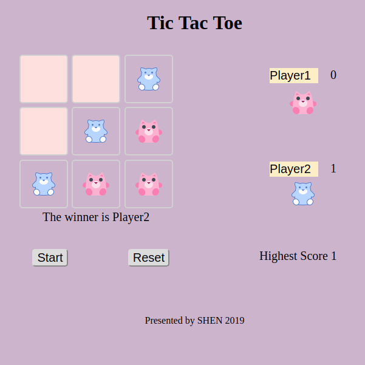

# Tic Tac Toe

## Game Rules

##### Tic-tac-toe is apaper-and-pencil game or two players,X and O, who take turns marking the spaces in a 3×3 grid. The player who succeeds in placing three of their marks in a horizontal, vertical, or diagonal row wins the game.

## ScreenShot

## Play [Click here](https://shen-guo.github.io/tic-tac-toe/)

## Project Process

### Day 1

1. Get the general Layout for html and css. 
2. Hard code winningcombinations and get the game working 

### Day 2

1. Adding animation and some feature for the game
2. Add function to generate winningcombination rather than just hard code

### Day 3 
1. website deployment using github
2. prepare readme file 

## Struggles

##### The first problem comes when I try to think of the methond to check who win the game.
I think it too generally and lost track. Since this is a really easy game and all the winning combinations is  limited, I gave each element div an id and list out all the winning situation and comparing with their id.  This get the game work. 

##### The second problem is when I try to add some sound effect and animation, things go wrong with those feature. I use animation css library to generate animation effect and it turn out that when I try to add more than one effect, they don’t get along very well.

##### Also I spent a lot of time is try to find out the pattern with winning combinations rather than just hard code. 

## summary

##### when it come to a real game, there are a lot of situation that need to take into consideration. How you design the layout, styles ,what data structure to use. How to abstract function to make it reusable. I have gained plenty of practice from this project.
